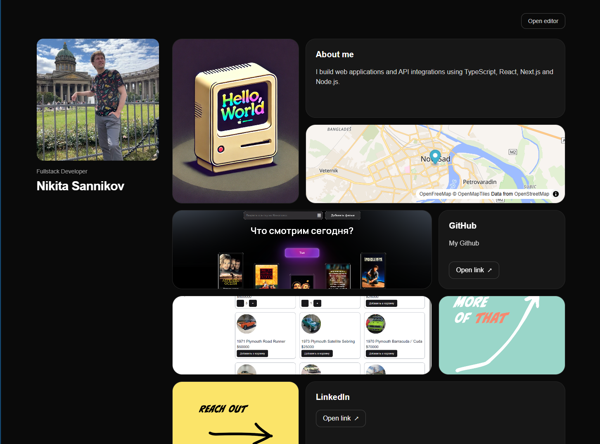
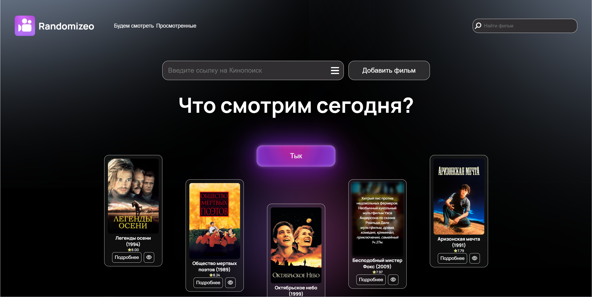
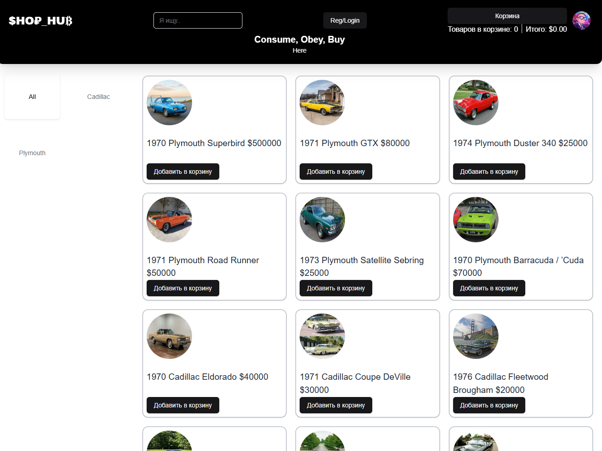
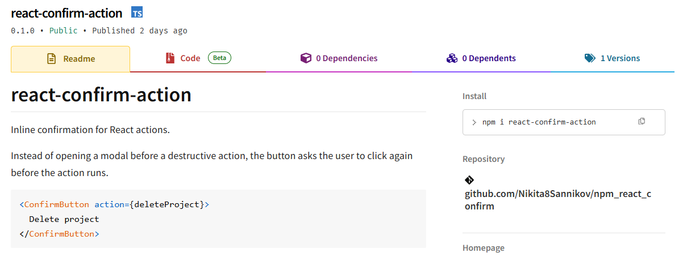

### 
Hi I'm Nikita!

  
  

 

## 
Fullstack Developer — TypeScript / Node.js / React

<!-- 
I build web applications and integrations with external APIs (REST, GraphQL, OAuth, webhooks).
 -->

- 🚀 **I’m currently working** on my [Bento Portfolio](https://github.com/Nikita8Sannikov/Bento-Portfolio-Next.js)
- 🌱 **I’m currently learning** Nest.js
- 🌍 **I'm based** in Serbia
- 🧩 **Fun Fact:** Coding is like a puzzle for me – I just happen to prefer digital pieces! 🔢🧠

## Languages and Tools:

 

## Github Stats

 

## Projects

  
  
  
  
  
  
  

  

Dynamic bento-style portfolio application built with Next.js.

[Repository](https://github.com/Nikita8Sannikov/Bento-Portfolio-Next.js) · [Demo](https://sannikov-portfolio.onrender.com/nikita)

  
  
  
  

  

Movie picker with authentication: keep a collection and randomize what to watch.

[Repository](https://github.com/Nikita8Sannikov/Randomizeo.Choose-your-movie-to-watch) · [Demo](https://randomizeo-choose-your-movie-to-watch.vercel.app/auth)

  
  
  
  
  
  
  
  

  

Fullstack e-commerce application with authentication, cart management and admin functionality.

[Repository](https://github.com/Nikita8Sannikov/ShopHub) · [Demo](https://shophub-nginx-v1-1.onrender.com)

  
  

  

Headless React confirmation utility for asynchronous actions. Provides a confirmation lifecycle hook and a ready-to-use confirmation component.

[GitHub](https://github.com/Nikita8Sannikov/npm_react_confirm) · [npm](https://www.npmjs.com/package/react-confirm-action)

  

Telegram bot built with Node.js, Telegraf and FFmpeg.

[Repository](https://github.com/Nikita8Sannikov/telegram_bot_krovostok) · [Demo](https://t.me/krovostok_your_voice_bot)

